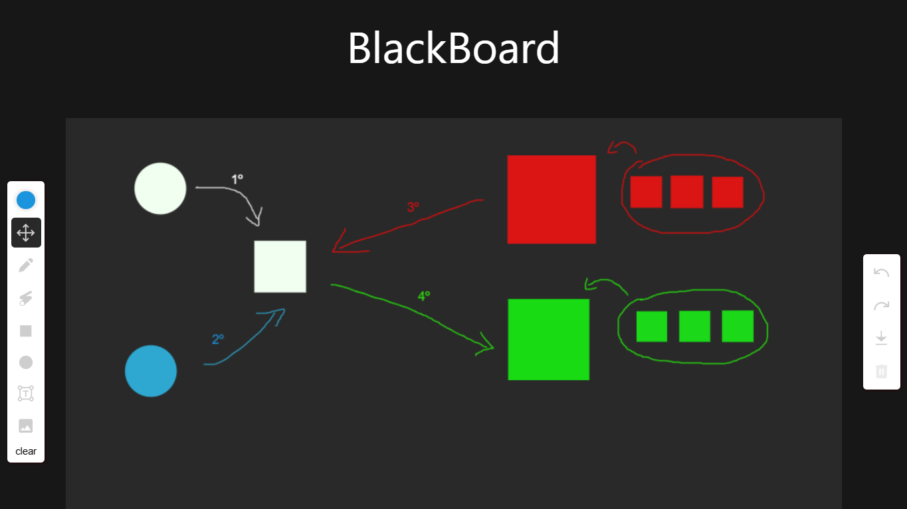

<a href="https://github.com/whosramoss/react-blackboard">
  
  <h1 align="center">React Blackboard</h1>
</a>

<p align="center">
  Interactive digital blackboard
</p>

<div align="center">
  
  
  
  
  
</div>
<br/>
<br/>


## How to install 

```bash
  # Clone the project
  git clone https://github.com/whosramoss/react-blackboard/

  # Go to the project directory
  cd react-blackboard

  # Install dependencies
  npm install

  # Start the server 
  npm run dev
```

## How to build 

```bash
  npm run build
```


## Contributing 
If you want to contribute to `react-blackboard`, please make sure to review the [contribution guidelines](https://github.com/whosramoss/react-blackboard/blob/master/CONTRIBUTING.md). This project makes use of [GitHub issues](https://github.com/whosramoss/react-blackboard/issues) for
tracking requests and bugs.

## License 

MIT License. [LICENSE](./LICENSE)

## Author 

Gabriel Ramos ([@whosramoss](https://github.com/whosramoss))

